# Chiikawa吉伊卡哇：30 张日常表情

更新：2026-10-09。全部保留原始 GIF 动画。名称为按画面起的描述名，未确认官方单图名称；名称带系列前缀，方便现有 ChatGPT 插件按系列挑选编号。第三方版权保留，未确认公开再分发许可。

| 编号 | 名称 | 功能 | 图片 | 来源 |
| --- | --- | --- | --- | --- |
| ck-001 | 吉伊卡哇·乌萨奇开心晃晃 | celebration | 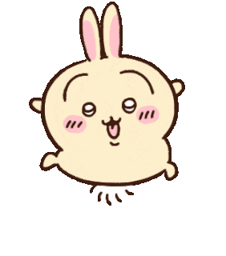 | [分享页面](https://chiikawawallpaper.com/zh-Hans/gif) |
| ck-002 | 吉伊卡哇·乌萨奇累趴了 | fatigue | 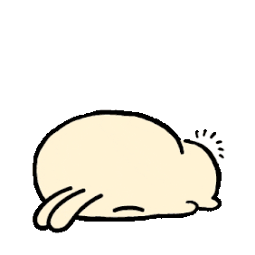 | [分享页面](https://chiikawawallpaper.com/zh-Hans/gif) |
| ck-003 | 吉伊卡哇·飞鼠害羞摇尾巴 | affection | 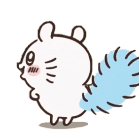 | [分享页面](https://chiikawawallpaper.com/zh-Hans/gif) |
| ck-004 | 吉伊卡哇·小八害羞笑笑 | affection | 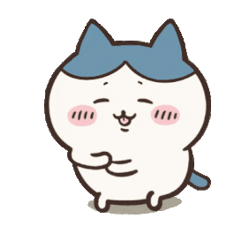 | [分享页面](https://chiikawawallpaper.com/zh-Hans/gif) |
| ck-005 | 吉伊卡哇·吉伊星星眼期待 | reaction | 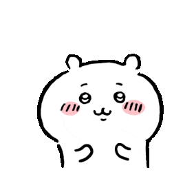 | [分享页面](https://chiikawawallpaper.com/zh-Hans/gif) |
| ck-006 | 吉伊卡哇·吉伊和小八开心跳跳 | celebration | 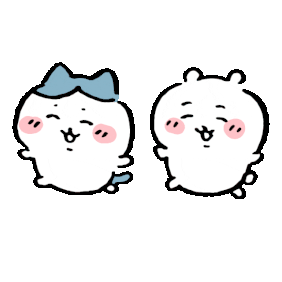 | [分享页面](https://chiikawawallpaper.com/zh-Hans/gif) |
| ck-007 | 吉伊卡哇·吉伊开饭啦 | food | 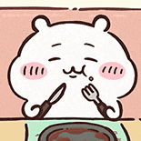 | [分享页面](https://chiikawawallpaper.com/zh-Hans/gif) |
| ck-008 | 吉伊卡哇·小八闪亮亮招手 | greeting | 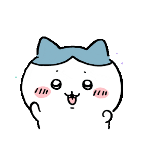 | [分享页面](https://chiikawawallpaper.com/zh-Hans/gif) |
| ck-009 | 吉伊卡哇·吉伊拿彩球加油 | comfort | 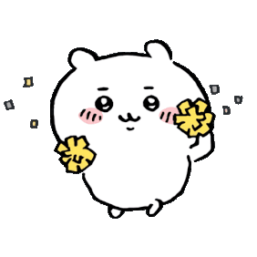 | [分享页面](https://chiikawawallpaper.com/zh-Hans/gif) |
| ck-010 | 吉伊卡哇·乌萨奇睡衣刷牙 | sleep | 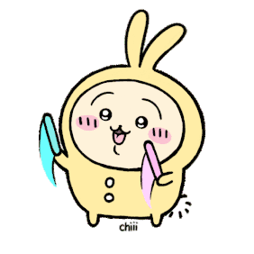 | [分享页面](https://chiikawawallpaper.com/zh-Hans/gif?page=2) |
| ck-011 | 吉伊卡哇·小八兴奋扭扭 | celebration | 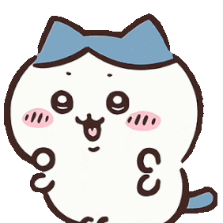 | [分享页面](https://chiikawawallpaper.com/zh-Hans/gif?page=2) |
| ck-012 | 吉伊卡哇·小八捧爱心 | affection | 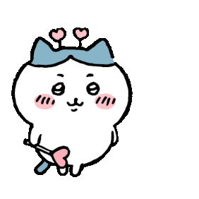 | [分享页面](https://chiikawawallpaper.com/zh-Hans/gif?page=2) |
| ck-013 | 吉伊卡哇·吉伊捧四叶草 | comfort |  | [分享页面](https://chiikawawallpaper.com/zh-Hans/gif?page=3) |
| ck-014 | 吉伊卡哇·吉伊生日快乐 | celebration | 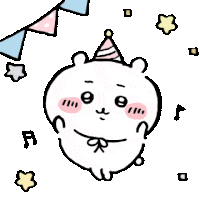 | [分享页面](https://chiikawawallpaper.com/zh-Hans/gif?page=3) |
| ck-015 | 吉伊卡哇·吉伊小八靠靠 | comfort | 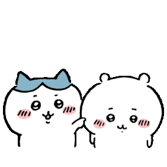 | [分享页面](https://chiikawawallpaper.com/zh-Hans/gif?page=3) |
| ck-016 | 吉伊卡哇·吉伊棉花糖冒火慌慌 | reaction | 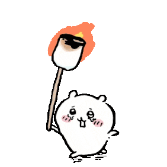 | [分享页面](https://chiikawawallpaper.com/zh-Hans/gif?page=3) |
| ck-017 | 吉伊卡哇·吉伊戴绿帽打招呼 | greeting | 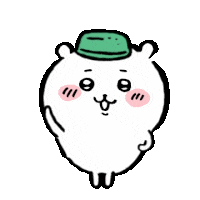 | [分享页面](https://chiikawawallpaper.com/zh-Hans/gif?page=3) |
| ck-018 | 吉伊卡哇·吉伊害羞小步走 | affection | 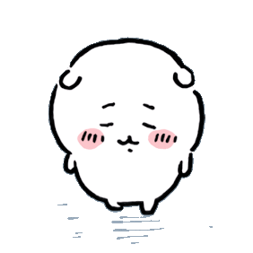 | [分享页面](https://chiikawawallpaper.com/zh-Hans/gif?page=3) |
| ck-019 | 吉伊卡哇·小八吃泡芙 | food | 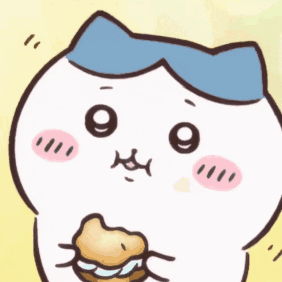 | [分享页面](https://chiikawawallpaper.com/zh-Hans/gif?page=3) |
| ck-020 | 吉伊卡哇·吉伊提小熊包包 | daily | 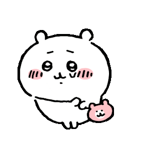 | [分享页面](https://chiikawawallpaper.com/zh-Hans/gif?page=3) |
| ck-021 | 吉伊卡哇·飞鼠捧碗吃饭 | food | 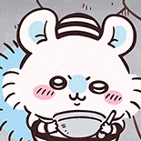 | [分享页面](https://chiikawawallpaper.com/zh-Hans/gif?page=3) |
| ck-022 | 吉伊卡哇·吉伊干劲满满 | comfort | 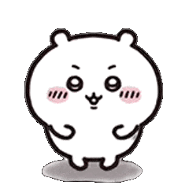 | [分享页面](https://chiikawawallpaper.com/zh-Hans/gif?page=4) |
| ck-023 | 吉伊卡哇·吉伊小八吃冰淇淋 | food | 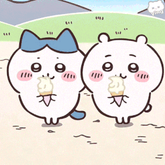 | [分享页面](https://chiikawawallpaper.com/zh-Hans/gif?page=4) |
| ck-024 | 吉伊卡哇·吉伊小八热乎乎泡澡 | daily |  | [分享页面](https://chiikawawallpaper.com/zh-Hans/gif?page=4) |
| ck-025 | 吉伊卡哇·乌萨奇抱胸自信笑 | reaction | 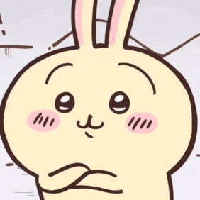 | [分享页面](https://chiikawawallpaper.com/zh-Hans/gif?page=4) |
| ck-026 | 吉伊卡哇·小八累累还在努力 | fatigue | 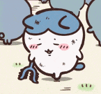 | [分享页面](https://chiikawawallpaper.com/zh-Hans/gif?page=4) |
| ck-027 | 吉伊卡哇·吉伊急死我了 | reaction | 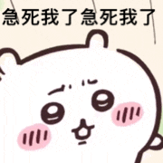 | [分享页面](https://chiikawawallpaper.com/zh-Hans/gif?page=4) |
| ck-028 | 吉伊卡哇·乌萨奇鼓腮干饭 | food | 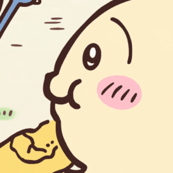 | [分享页面](https://chiikawawallpaper.com/zh-Hans/gif?page=4) |
| ck-029 | 吉伊卡哇·吉伊闹钟里睡觉 | sleep | 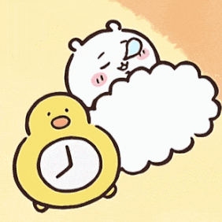 | [分享页面](https://chiikawawallpaper.com/zh-Hans/gif?page=2) |
| ck-030 | 吉伊卡哇·小八雨里委屈抱抱 | complaint | 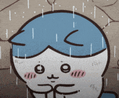 | [分享页面](https://chiikawawallpaper.com/zh-Hans/gif?page=2) |
